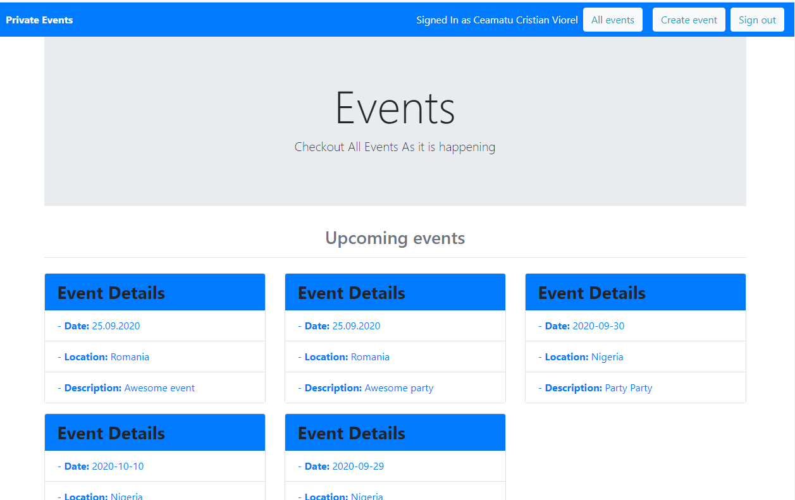

 

# Private events web app built in rails

> In this project, we built by collaborating remotely a private events app following the project requirements from [TheOdinProject website](https://www.theodinproject.com/courses/ruby-on-rails/lessons/associations). The project enforced our skills in using Model associations and create from scratch Models, Controllers, Views, and Migrations.

## App functionality
* Users can be created, they can sign in and sign out
* Users can create and attend events
* Events are categorized in past and upcoming events based on their date

## This web app is live, you can check it here: [Live demo](https://obscure-sierra-39976.herokuapp.com/)

## Screenshot of the project.

## Built With
* Ruby
* Rails
* RSpec

## Prerequisities

To get this project up and running locally, you must have ruby installed on your computer.

## Getting Started

**To get this project set up on your local machine, follow these simple steps:**

**Step 1** 
Navigate through the local folder where you want to clone the repository and run 
`https://github.com/cristianCeamatu/microverse-rails-private-events`. It will clone the repo to your local folder. 
or with https 
`git clone https://github.com/cristianCeamatu/microverse-rails-private-events.git`. 
**Step 2** 
Run `cd microverse-rails-private-events` 
**Step 3** 
Run `bundle install` to install the gems from the `Gemfile`. 
**Step 4** 
Run `yarn install` to install the npm packages from the `package.json` file. 
**Step 5** 
Run `rails db:migrate` to migrate the database tabels and associations. 
**Step 6** 
Run `rails s` to start the rails server. 
**Step 7** 
You can visit the app at `http://localhost:3000`. 

## Tests

1. Open Terminal

2. Migrate the test database:

    `rails db:migrate RAILS_ENV=test`

2. Run the tests with the command:

    `rspec`

## Authors

👤 **Marshall Akpan**

- Github: [uimarshall](https://github.com/uimarshall)
- Twitter: [uimarshall](https://twitter.com/uimarshall)
- Linkedin: [Marshall Akpan](https://www.linkedin.com/in/marshall-akpan-19745526/)

👤 **Cristian Viorel Ceamatu**

- Github: [@cristianCeamatu](https://github.com/cristianCeamatu)
- Twitter: [@CeamatuV](https://twitter.com/CeamatuV)
- Linkedin: [Ceamatu Cristian](https://www.linkedin.com/in/ceamatu-cristian/)

## 🤝 Contributing

Our favourite contributions are those that help us improve the project, whether with a contribution, an issue, or a feature request!

Feel free to check the [issues page](https://github.com/cristianCeamatu/microverse-ruby-telegram-bot/issues) to either create an issue or help us out by fixing an existing one.

## Show your support

If you've read this far....give us a ⭐️!

## 📝 License

This project is licensed by Microverse and the Odin Project